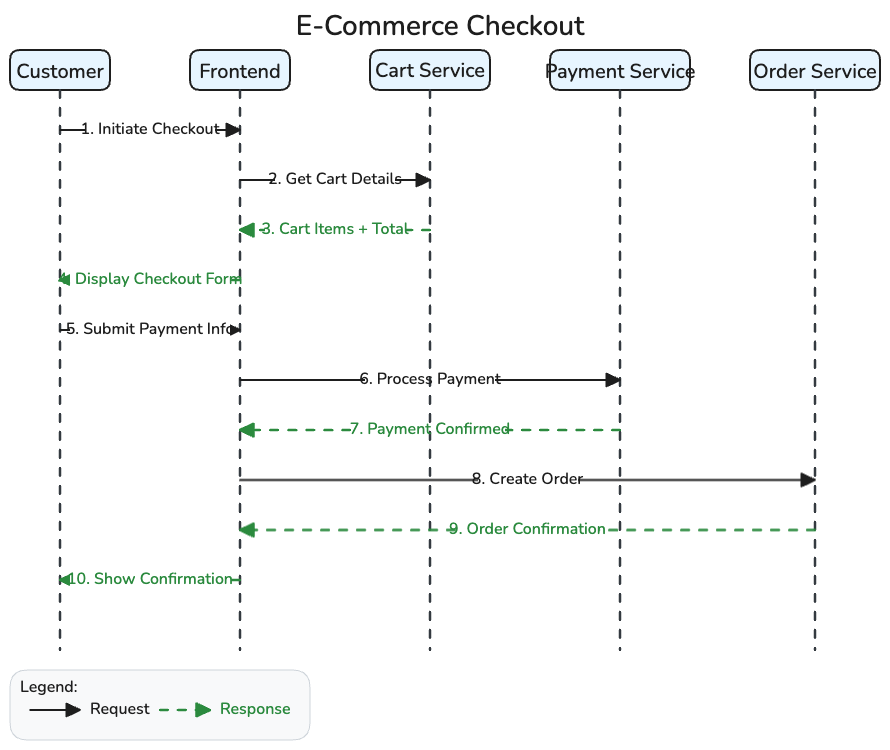
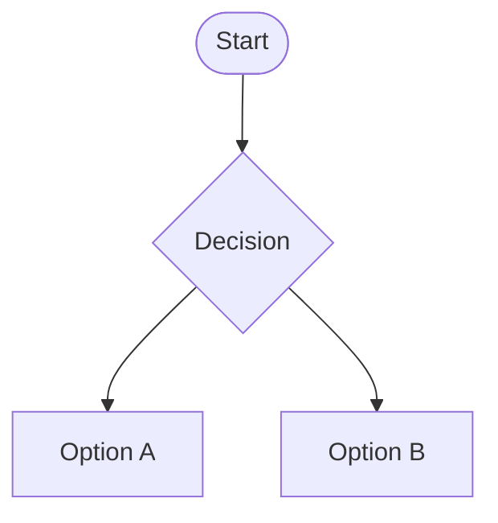
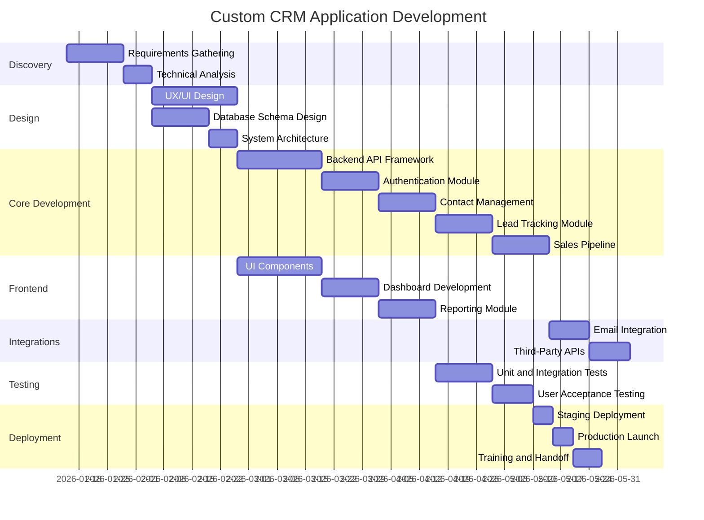
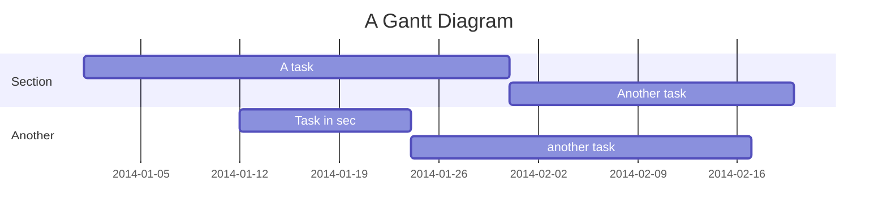
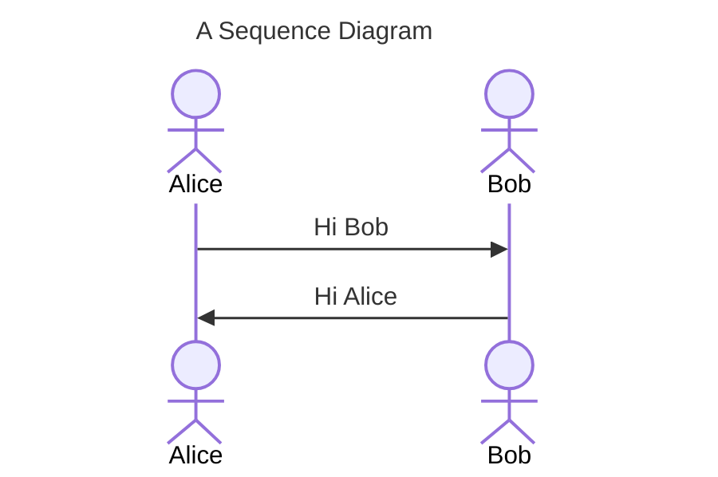

# Title

## Excalidraw: E-Commerce Checkout Sequence

## Mermaid: Examples

### Mermaid via PNG

### FLow

```mermaid
flowchart
        A(["Start"])
        A --> B{"Decision"}
        B --> C["Option A"]
        B --> D["Option B"]
```

### Gantt: Custom CRM Development

```mermaid
gantt
    title Custom CRM Application Development
    dateFormat YYYY-MM-DD

    section Discovery
    Requirements Gathering      :req, 2026-01-15, 14d
    Technical Analysis          :tech, after req, 7d

    section Design
    UX/UI Design                :ux, after tech, 21d
    Database Schema Design      :db, after tech, 14d
    System Architecture         :arch, after db, 7d

    section Core Development
    Backend API Framework       :api, after arch, 21d
    Authentication Module       :auth, after api, 14d
    Contact Management          :contacts, after auth, 14d
    Lead Tracking Module        :leads, after contacts, 14d
    Sales Pipeline              :pipeline, after leads, 14d

    section Frontend
    UI Components               :ui, after ux, 21d
    Dashboard Development       :dash, after ui, 14d
    Reporting Module            :reports, after dash, 14d

    section Integrations
    Email Integration           :email, after pipeline, 10d
    Third-Party APIs            :thirdparty, after email, 10d

    section Testing
    Unit and Integration Tests  :unittest, after reports, 14d
    User Acceptance Testing     :uat, after unittest, 10d

    section Deployment
    Staging Deployment          :staging, after uat, 5d
    Production Launch           :prod, after staging, 5d
    Training and Handoff        :train, after prod, 7d
```

### Gannt: Simple Example

```mermaid
gantt
    title A Gantt Diagram
    dateFormat  YYYY-MM-DD
    section Section
    A task           :a1, 2014-01-01, 30d
    Another task     :after a1  , 20d
    section Another
    Task in sec      :2014-01-12  , 12d
    another task      : 24d
```

### Sequence

```mermaid
sequenceDiagram
        title A Sequence Diagram
        actor Alice
        actor Bob
        Alice->>Bob: Hi Bob
        Bob->>Alice: Hi Alice
```

