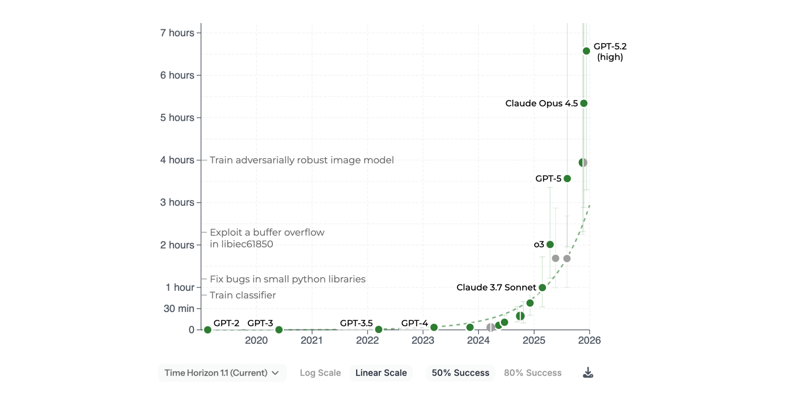
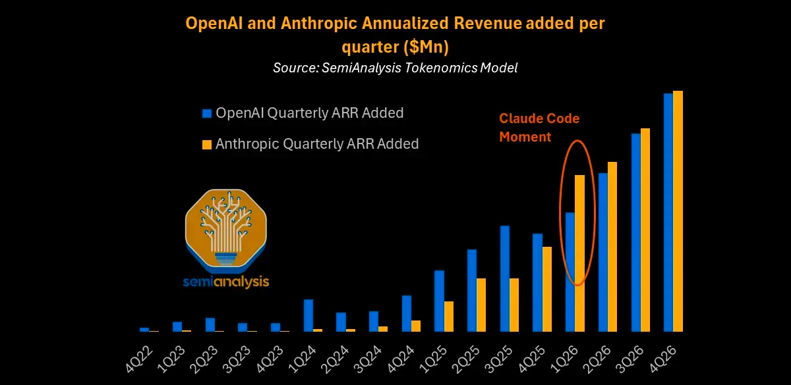
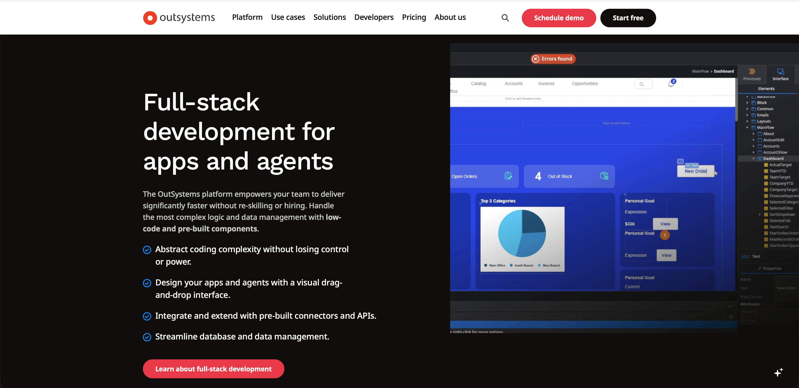
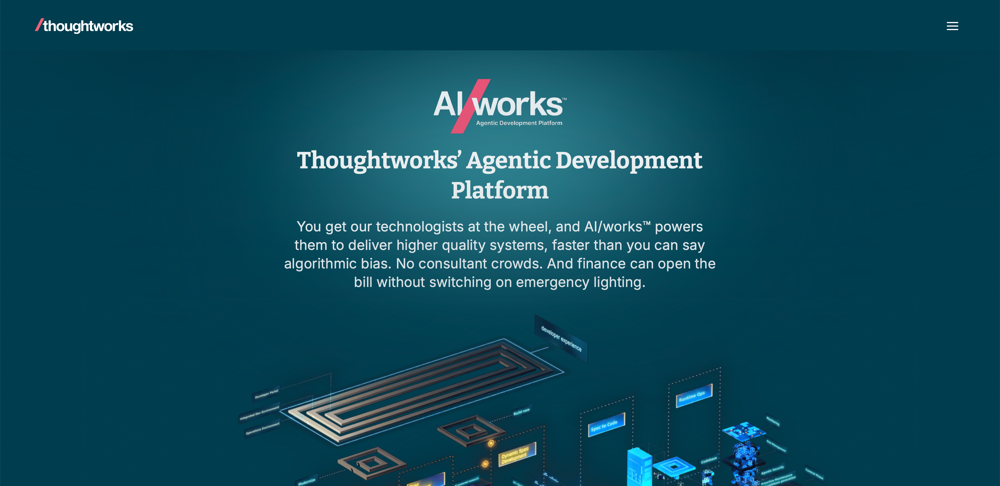

## mgm A12

# Positioning for the future 

<!-- This is a **note** page 1-->

---

## The market 02/2026

---
layout: caption
---

::image::

---
layout: caption
---

::image::

---
layout: caption
---

::image::

---

These 1 (Thema Agentic Coding)

## 90 % der Software Entwicklung im Enterprise Markt wird mit AI Unterstützung stattfinden.

---

These 2 (Thema Effizienz)

## Kleine Softwareunternehmen und Freelancer werden durch AI größere Projekte stemmen können.

---

These 3 (Thema Zusammenarbeit)

## Durch AI werden neue Stakeholder in Projekten AKTIV mitmischen: Produktmanager, Spezialisten, Fachexperten

---

Die Folgen für den Enterprise Software Markt

### 1. Verschiebung von Marktanteilen  
### 2. Tendenziell sinkende Preise
### 3. Neue Plattformen für "das Entwickeln mit AI" 

---
layout: caption
---

::image::

---
layout: caption
---

::image::

---

Fragen an uns:

## Wie positionieren wir uns in der Zukunft?

---

## Welche Assets bringen wir mit?

---

## Wo haben wir Lücken?

---

## Welche Chancen tun sich für uns auf?

---
layout: default
---

## Agenda

### 1. Eine möglichen Lösungsstrategie für A12
### 2. Vision für eine A12 Agentic Platform
### 3. Nächste Schritte

---

## 1. 
## Eine möglichen Lösungsstrategie für A12

---
layout: grid
cols: 3
---

  

## Technologie

AI Agentic Coding als Default

  

## Effizienz

Konkurrenz durch kleinere Unternehmen und Teams, die AI einsetzen

  

## Kollaboration

Neue AKTIVE Projektbeteiligte durch AI Tools.

---

### Um konkurrenzfähig zu bleiben
### muss A12 Software-Entwicklung mit AI bestmöglich unterstützen:
## Technologie, Effizienz, Kommunikation

---
layout: caption
---

::image::

---
layout: caption
---

::image::

---
layout: caption
---

::image::

---
layout: caption
---

::image::

---
layout: default
---

## Bewertung

### - Wir sind gut in Laufzeitumgebung, Server, Auth...
### - Wir haben viele Modelle und Komponenten
### - Wir haben eine geringe "Editor-Abdeckung" (nur SME)
### - Wir haben keinen AI-zentrierten Entwicklungsprozess

---
layout: default
---

## Strategie

### - Basis: Ein AI-zentrierter Entwicklungsprozess 
### - Für alle Domänen: Fachlichkeit, Technologie, Projektabwicklung
### - Ziel: Agentic Coding, Effizienz, Kollaboration

---

## Demo / Screens "A12 Agentic Studio"

---
layout: default
---

## Nächste Schritte

 

#### 1. Agentic Coding in den A12 Teams etablieren
#### 2. Einheitliche, AI-kompatible Repräsentation: Model Graph
#### 3. Umfassender AI-zentrierter Entwicklungsprozess - für ALLE Projektbeteiligten
#### (z. B. "Spec-Driven-Development" aus allen Perspektiven: Fachl./Techn./Projekt)

 

### Ziel: Agentic Coding, Effizienz, Kollaboration

---
layout: title
---

# Now Go and Move Mountains
