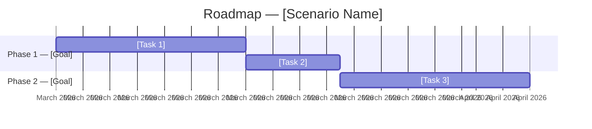

<objective>

Interactive exploration of implementation scenarios based on Summary-Level Use Cases. Optional step between `/uc:new-project` and `/uc:use-case-analysis`.

Enables parallel exploration of 1-n implementation scenarios with HTML clickdummies and Mermaid roadmaps before selecting a final scenario as input for `/uc:use-case-analysis`.

**Requires:** `.planning/PROJECT.md` with `## Use Cases (Summary)` section (created by `/uc:new-project`)

**Creates:**
- `.planning/scenarios/SCENARIOS-STATE.md` — Index of all scenarios + status
- `.planning/scenarios/scenario-NN-[slug]/SCENARIO.md` — Collected ideas, decisions, features
- `.planning/scenarios/scenario-NN-[slug]/HISTORY.md` — Chronological protocol
- `.planning/scenarios/scenario-NN-[slug]/YYYYMMDD_HHMMSS_wireframe.html` — HTML clickdummy
- `.planning/scenarios/scenario-NN-[slug]/roadmap.md` — Mermaid roadmap
- `.planning/scenarios/final/FINAL-SCENARIO.md` — The final, approved scenario

**After this command:** Run `/uc:use-case-analysis` to extract use cases (uses final scenario as context).

</objective>

<execution_context>

@./.claude/use-case-driven/references/questioning.md
@./.claude/use-case-driven/references/ui-brand.md

</execution_context>

<process>

## Phase 1: Check Prerequisites

**MANDATORY FIRST STEP — Execute these checks before ANY user interaction:**

1. **Abort if PROJECT.md missing:**
   ```bash
   [ ! -f .planning/PROJECT.md ] && echo "ERROR: No project found. Run /uc:new-project first." && exit 1
   ```

2. **Summary-Level Use Cases present?**
   - Read `.planning/PROJECT.md`
   - Verify that `## Use Cases (Summary)` section contains at least one UC-S-XXX
   - If not: error with hint to run `/uc:new-project`

3. **Load existing scenarios:**
   ```bash
   if [ -f .planning/scenarios/SCENARIOS-STATE.md ]; then
     echo "Existing exploration found"
   fi
   ```

## Phase 2: Main Menu

**Display stage banner:**

```
━━━━━━━━━━━━━━━━━━━━━━━━━━━━━━━━━━━━━━━━━━━━━━━━━━━━━
 UC ► FEATURE EXPLORATION
━━━━━━━━━━━━━━━━━━━━━━━━━━━━━━━━━━━━━━━━━━━━━━━━━━━━━
```

**If no scenarios exist:** Go directly to Phase 3 (Create New Scenario).

**If scenarios exist:** Show overview and selection menu.

```
## Current Scenarios

| # | Name | Status | Core Idea | Rounds |
|---|------|--------|-----------|--------|
| 1 | [Name] | Active / Paused | [Core Idea] | [N] |
| 2 | [Name] | Active / Paused | [Core Idea] | [N] |

Final Scenario: Not yet determined
```

Use AskUserQuestion:
- header: "Action"
- question: "What would you like to do?"
- options:
  - "Continue working on scenario" — Continue developing an existing scenario
  - "Create new scenario" — Start a new implementation idea
  - "Delete scenario" — Remove an existing scenario
  - "Finalize scenario" — Complete exploration and define the final scenario

## Phase 3: Create New Scenario

Use AskUserQuestion:
- header: "Scenario"
- question: "Give the new scenario a short name (e.g. 'Wizard-based', 'Dashboard-First', 'Kanban-Style')."

Then:
- header: "Core Idea"
- question: "Describe the core idea of this scenario in 1-2 sentences."

**Create directory:**
```bash
SCENARIO_NUM=$(printf "%02d" [next available number])
SCENARIO_SLUG=[slug from name, lowercase-with-hyphens]
mkdir -p ".planning/scenarios/scenario-${SCENARIO_NUM}-${SCENARIO_SLUG}"
```

**Create initial files:**

`SCENARIO.md` — Base structure:
```markdown
# Scenario: [Name]

> Core Idea: [1-2 sentences]
> Created: [Date]
> Last Updated: [Date]

## Mapping to Summary-Level Use Cases

| UC | Name | Implementation Approach in this Scenario |
|----|------|------------------------------------------|
| UC-S-001 | [Name] | [Not yet defined] |
| UC-S-002 | [Name] | [Not yet defined] |

## Interaction Concept & User Workflows

[No workflows defined yet]

## Capabilities & Features

| Feature | Description | Related UC | Priority |
|---------|------------|------------|----------|

## UI Concept

[No UI concept defined yet]

## Proposed User-Goal Use Cases

| ID (Draft) | Name | Related UC-S | Description |
|-------------|------|--------------|-------------|

> Note: IDs with prefix "UG-E" (Exploration) — will be converted
> to official UC-UG-XXX IDs upon finalization.

## Proposed Roadmap Phases

| Phase | Goal | Use Cases | Rationale |
|-------|------|-----------|-----------|

## Open Questions & Notes

- [None yet]
```

`HISTORY.md` — Header:
```markdown
# Scenario [Name] — History
```

**Update SCENARIOS-STATE.md** (create if not present):
```markdown
# Feature Exploration — Scenarios

> Project: [Project name from PROJECT.md]
> Created: [Date]
> Last Updated: [Date]

## Scenarios

| # | Name | Status | Core Idea | Last Modified |
|---|------|--------|-----------|---------------|
| 1 | [Name] | Active | [Core Idea] | [Date] |

## Final Scenario

Status: Open
Source: —
```

**Git commit:**
```bash
git add ".planning/scenarios/"
git commit -m "docs(exploration): new scenario created — [Name]"
```

**Continue with Phase 5 (Interactive Work on Scenario).**

## Phase 4: Select Scenario (Continue Working)

**If only 1 scenario:** Select it directly.

**If multiple scenarios:**

Use AskUserQuestion:
- header: "Scenario"
- question: "Which scenario would you like to continue working on?"
- options: [List of scenarios with Name + Core Idea]

**Load:**
- `SCENARIO.md` — current state
- `HISTORY.md` — previous questions/answers (last 3 rounds as context)

**Show summary:**
```
## Scenario: [Name]
Core Idea: [...]
Previous Rounds: [N]
Last Discussed: [Topic of last round]

Not yet covered Summary Use Cases: UC-S-003, UC-S-005
```

**Continue with Phase 5.**

## Phase 5: Interactive Work on Scenario (Core Process)

This is the central, iterative process. It repeats until the user switches or exits.

### 5.1 Topic Suggestion & Question

**Analyze the current state of the scenario:**
- Which Summary-Level UCs are not yet / weakly covered?
- Which areas are missing: interaction concept? Workflows? Features? UI concept?
- What follows logically from previous answers?

**Ask ONE targeted question** (following the questioning.md pattern):
- Questions about interaction, user workflows, capabilities, UI approaches
- Suggest options where appropriate (AskUserQuestion with concrete alternatives)
- Show context: "Regarding UC-S-002 (Assess Risk)..."

**Question areas (non-exhaustive):**

| Area | Example Questions |
|------|-------------------|
| **User Workflow** | "How should the user start a new action — via a form, import, or drag & drop?" |
| **UI Layout** | "Should the interface be more of an overview dashboard or a focused wizard?" |
| **Navigation** | "How does the user navigate between areas — sidebar, tabs, search bar?" |
| **Data Entry** | "Should data be captured in one large form or in logical steps?" |
| **Automation** | "Which steps should happen automatically (e.g. completeness check)?" |
| **Collaboration** | "How should approval/collaboration work?" |
| **Prioritization** | "Which Summary Use Case is most important for you to start with?" |

**Topic Guardrails:**
- No technical architecture questions (Claude decides that later)
- No library/framework questions
- Focus on user-visible behavior, workflows, features

### 5.2 Process Answer & Persist

After EVERY answer:

1. **Update SCENARIO.md** — add new information to the appropriate section
2. **Update HISTORY.md** — log question, answer, and result:
   ```markdown
   ## Round N — [Date, Time]
   **Topic:** [Area]
   **Question:** [Question asked]
   **Answer:** [Summary of user's answer]
   **Result:** [What was updated in SCENARIO.md]
   **Visualization:** [Clickdummy updated: yes/no] [Roadmap updated: yes/no]
   ```
3. **Update SCENARIOS-STATE.md** — last modified timestamp

### 5.3 Offer Visualization

After each answer, ask:

Use AskUserQuestion:
- header: "Visualization"
- question: "Should I update the clickdummy and/or roadmap?"
- options:
  - "Update both" — Regenerate clickdummy + roadmap diagram
  - "Clickdummy only" — Update HTML wireframe
  - "Roadmap only" — Update Mermaid diagram
  - "No, continue with questions" — No visualization, next question

**Alternative:** If the answer contains no visually relevant change (e.g. pure prioritization), the question can be skipped and "No, continue with questions" suggested directly.

### 5.4 Generate HTML Clickdummy

**Format:** Standalone HTML with embedded CSS (shadcn styling) and JavaScript.
- New file per version: `YYYYMMDD_HHMMSS_wireframe.html`
- Directly openable in browser
- Interactive elements: clickable navigation, sample data, tooltips
- Visualizes the collected UI concepts, workflows, and features so far
- Shows the most important screens/views of the scenario
- Uses placeholder `[TBD]` for areas not yet discussed
- German labels (labels, buttons, error messages)
- Desktop-optimized

**Location:**
```
.planning/scenarios/scenario-NN-[slug]/YYYYMMDD_HHMMSS_wireframe.html
```

### 5.5 Generate Mermaid Roadmap

**Format:** Markdown file with Mermaid code block.

```markdown
# Roadmap — Scenario: [Name]

> Generated: [Date]

## Phase Overview



## Phase Details

| Phase | Goal | User-Goal UCs (Draft) | Estimated Complexity |
|-------|------|-----------------------|----------------------|
| 1 | [...] | UG-E-001, UG-E-002 | Medium |
| 2 | [...] | UG-E-003, UG-E-004 | High |
```

**Location:** `roadmap.md` in the scenario directory (overwritten on each update).

### 5.6 Choose Next Action

After visualization (or if skipped):

Use AskUserQuestion:
- header: "Next"
- question: "How would you like to continue?"
- options:
  - "Next question" — Continue working on current scenario
  - "Back to main menu" — Switch scenario, create new, delete, or finalize

**On "Next question":** Return to 5.1.
**On "Back to main menu":** Return to Phase 2.

### 5.7 Git Commits

**Automatic commits at defined points:**
- After every 3rd interaction round (not after each individual one)
- Commit format: `docs(exploration): scenario updated — [Name] (rounds N-M)`

## Phase 6: Delete Scenario

Use AskUserQuestion:
- header: "Delete"
- question: "Which scenario would you like to delete?"
- options: [List of scenarios]

**Safety confirmation:**

Use AskUserQuestion:
- header: "Confirm"
- question: "Really delete scenario '[Name]'? All files (including clickdummies) will be removed."
- options:
  - "Yes, delete" — Permanently remove
  - "Cancel" — Back to main menu

**On confirmation:**
```bash
rm -rf ".planning/scenarios/scenario-NN-[slug]"
```
- Update `SCENARIOS-STATE.md` (remove scenario)
- Git commit: `docs(exploration): scenario deleted — [Name]`
- Return to Phase 2

## Phase 7: Set Final Scenario

**Display stage banner:**

```
━━━━━━━━━━━━━━━━━━━━━━━━━━━━━━━━━━━━━━━━━━━━━━━━━━━━━
 UC ► FINALIZATION
━━━━━━━━━━━━━━━━━━━━━━━━━━━━━━━━━━━━━━━━━━━━━━━━━━━━━
```

**Show scenario comparison:**

```
## Scenarios Compared

| Aspect | Scenario 1: [Name] | Scenario 2: [Name] |
|--------|--------------------|-----------------------|
| Core Idea | [...] | [...] |
| UC-S-001 | [...] | [...] |
| Features | [N] | [N] |
| Draft UGs | [N] | [N] |
| Phases | [N] | [N] |
```

Use AskUserQuestion:
- header: "Finalization"
- question: "How would you like to determine the final scenario?"
- options:
  - "Adopt scenario directly" — Use one of the scenarios 1:1 as the final scenario
  - "Synthesis (dialog-guided)" — Combine elements from multiple scenarios through dialog
  - "Automatic synthesis" — Let Claude generate the best combination automatically

### 7.1 Direct Adoption

Use AskUserQuestion:
- header: "Selection"
- question: "Which scenario should be adopted as the final scenario?"
- options: [List of scenarios]

**Action:**
```bash
mkdir -p ".planning/scenarios/final"
```
- Copy `SCENARIO.md` → `final/FINAL-SCENARIO.md`
- Copy latest clickdummy → `final/`
- Copy `roadmap.md` → `final/`
- Update `SCENARIOS-STATE.md` (Status: Finalized, Source: Scenario X)

### 7.2 Dialog-Guided Synthesis

Interactive process comparing scenarios area by area:

**For each area (Workflows, Features, UI Concept, Roadmap):**

1. Show approaches from different scenarios side by side
2. Use AskUserQuestion: "Which approach do you prefer for [area]?"
   - Options: Scenario 1 / Scenario 2 / ... / Custom idea
3. Add result to `FINAL-SCENARIO.md`

**After completing all areas:**
- Generate new clickdummy visualizing the synthesis
- Generate new roadmap
- Use AskUserQuestion: "Is the final scenario correct?"
  - "Yes, finalize" — Complete
  - "Adjust" — Which area should be changed?

### 7.3 Automatic Synthesis

Claude analyzes all scenarios and automatically generates an optimal final scenario:

**Criteria:**
- Features with the highest coverage of Summary-Level UCs
- Most consistent UI concept
- Most pragmatic roadmap (must-have features first)
- No conflicting approaches

**Present result:**
- Show `FINAL-SCENARIO.md` with annotations indicating where each element originated
- Generate clickdummy + roadmap
- Use AskUserQuestion: "Is the automatic synthesis acceptable?"
  - "Yes, finalize" — Complete
  - "Adjust" — Switch to dialog-guided synthesis (7.2)
  - "Regenerate" — Provide different weighting

### 7.4 Complete Finalization

```bash
mkdir -p ".planning/scenarios/final"
git add ".planning/scenarios/"
git commit -m "docs(exploration): final scenario set — [Name/Synthesis]"
```

**Continue with Phase 8.**

## Phase 8: Completion

```
━━━━━━━━━━━━━━━━━━━━━━━━━━━━━━━━━━━━━━━━━━━━━━━━━━━━━
 UC ► FEATURE EXPLORATION COMPLETE ✓
━━━━━━━━━━━━━━━━━━━━━━━━━━━━━━━━━━━━━━━━━━━━━━━━━━━━━

**[Project Name]**

| Artifact              | Location                                     |
|-----------------------|----------------------------------------------|
| Final Scenario        | `.planning/scenarios/final/FINAL-SCENARIO.md` |
| Final Clickdummy      | `.planning/scenarios/final/[timestamp]_wireframe.html` |
| Final Roadmap         | `.planning/scenarios/final/roadmap.md`        |
| Scenarios Index       | `.planning/scenarios/SCENARIOS-STATE.md`      |

**[N] scenarios explored** | **Final Scenario: [Name/Synthesis]** ✓

───────────────────────────────────────────────────────

## ▶ Next Up

**Use Case Analysis & Roadmap** — uses final scenario as additional context

`/uc:use-case-analysis`

<sub>`/clear` first → fresh context window</sub>

───────────────────────────────────────────────────────

**Also available:**
- `/uc:feature-exploration` — Reopen exploration (edit scenarios)
- `/uc:progress` — View use case completion status
- `/uc:help` — Show all available commands

───────────────────────────────────────────────────────
```

</process>

<success_criteria>

- [ ] Prerequisites checked (PROJECT.md with Summary-Level UCs present)
- [ ] Existing scenarios detected and loaded (if present)
- [ ] Main menu with all 4 actions functional
- [ ] Create new scenario: name, core idea, directory, initial files
- [ ] Interactive core process: ask questions, process answers, persist
- [ ] HTML clickdummy: standalone, shadcn styling, interactive, versioned
- [ ] Mermaid roadmap: Gantt diagram with phases and tasks
- [ ] Interruption possible at any time, no progress lost
- [ ] Delete scenario with safety confirmation
- [ ] Finalization: direct adoption, dialog-guided synthesis OR automatic synthesis
- [ ] Final scenario placed in `.planning/scenarios/final/`
- [ ] SCENARIOS-STATE.md consistently updated
- [ ] User knows next step is `/uc:use-case-analysis`

</success_criteria>
