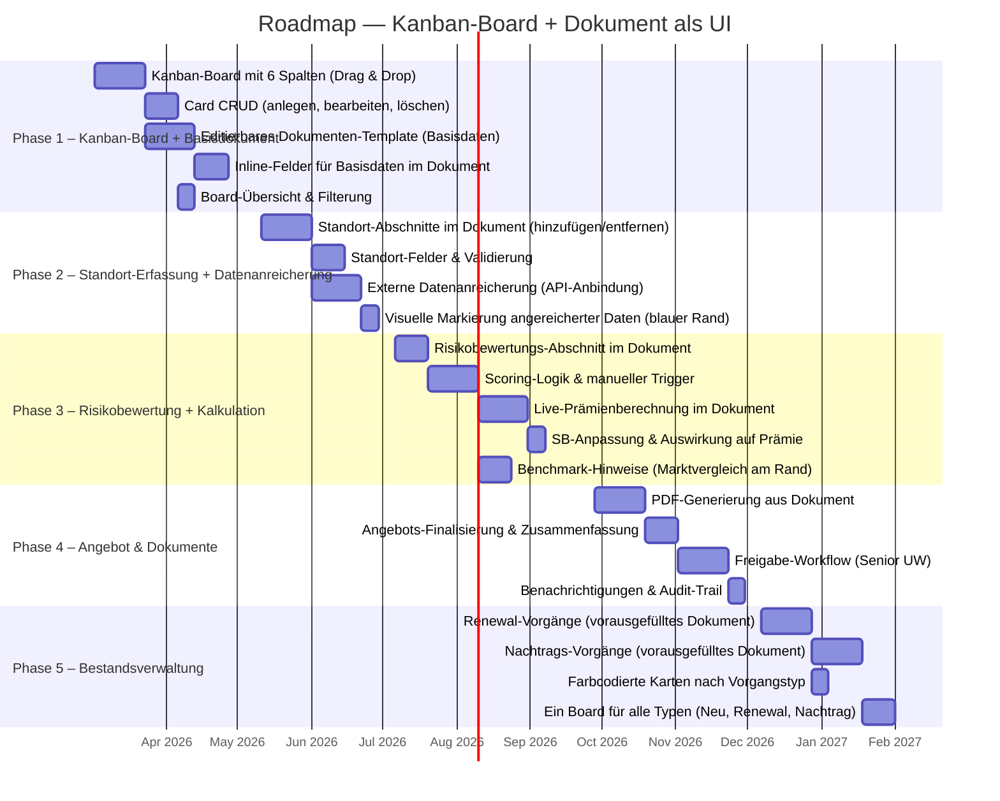

# Roadmap — Scenario: Kanban-Board + Dokument als UI

> Generated: 2026-02-22

## Phase Overview

## Phase Details

| Phase | Ziel | User-Goal UCs (Entwurf) | Geschätzte Komplexität |
|-------|------|--------------------------|------------------------|
| **Phase 1 — Kanban-Board + Basisdokument** | Funktionsfähiges Kanban-Board mit 6 Prozesschritt-Spalten, Card-CRUD und ein editierbares Dokumenten-Template mit Inline-Feldern für Basisdaten (VN, Branche, Vertragsdaten). | UG-E-001: Vorgang anlegen — Neue Karte auf Board, leeres Template öffnen | **Hoch** |
| | | UG-E-002: Basisdaten erfassen — Inline-Felder im Dokument ausfüllen | |
| | | UG-E-003: Board-Übersicht — Alle Vorgänge auf dem Kanban-Board sehen | |
| **Phase 2 — Standort-Erfassung + Datenanreicherung** | Standort-Abschnitte im Dokument dynamisch hinzufügen/entfernen, externe Datenquellen anbinden und angereicherte Felder visuell mit blauem Rand markieren. | UG-E-004: Standort erfassen — Standort-Abschnitt im Dokument hinzufügen/ausfüllen | **Hoch** |
| | | UG-E-005: Daten anreichern — Automatische Anreicherung mit Markierung | |
| **Phase 3 — Risikobewertung + Kalkulation** | Risikobewertungs-Abschnitt mit manuell auslösbarem Scoring, Live-Prämienberechnung direkt im Dokument und Benchmark-Hinweise am Dokumentrand. | UG-E-006: Risiko bewerten — Bewertung im Dokument triggern, Scoring einsehen | **Sehr hoch** |
| | | UG-E-007: Prämie berechnen — Live-Prämie im Dokument, SB anpassen | |
| | | UG-E-008: Benchmarks einsehen — Marktvergleich am Rand | |
| **Phase 4 — Angebot & Dokumente** | PDF-Generierung aus dem Dokument, Finalisierung des Angebots mit Zusammenfassung und Freigabe-Workflow über Senior Underwriter. | UG-E-009: Angebot finalisieren — PDF generieren, Zusammenfassung | **Mittel** |
| | | UG-E-010: Freigabe erteilen — Vorgang zur Freigabe vorlegen (Senior UW) | |
| **Phase 5 — Bestandsverwaltung** | Renewal- und Nachtrags-Vorgänge mit vorausgefüllten Dokumenten, farbcodierte Karten nach Vorgangstyp, ein gemeinsames Board für alle Vorgangsarten. | UG-E-011: Renewal bearbeiten — Vorausgefülltes Dokument für Vertragserneuerung | **Mittel** |
| | | UG-E-012: Nachtrag bearbeiten — Vorausgefülltes Dokument für Vertragsänderung | |
