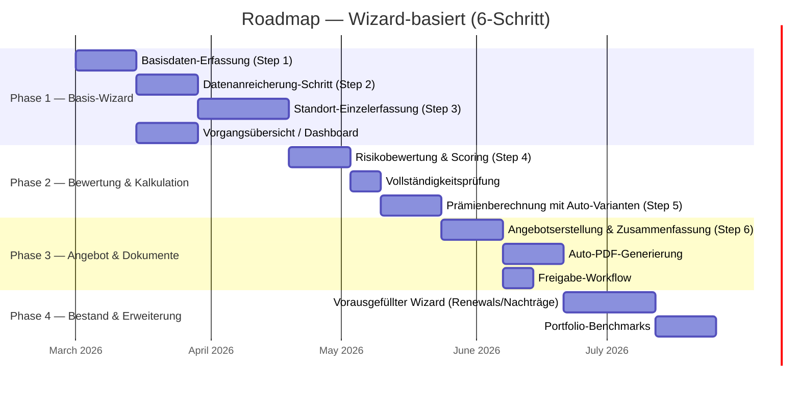

# Roadmap — Scenario: Wizard-basiert

> Generated: 2026-02-21 (v2 — 6-Schritt-Wizard mit Datenanreicherung)

## Phase Overview

## Phase Details

| Phase | Goal | User-Goal UCs (Draft) | Key Features | Complexity |
|-------|------|-----------------------|--------------|------------|
| 1 | Basis-Wizard: Basisdaten + Anreicherung + Standorterfassung + Dashboard | UG-E-001, UG-E-002, UG-E-003, UG-E-011 | Manueller Wizard (Steps 1-3), Datenanreicherung, Standort-Loop, Dashboard | High |
| 2 | Bewertung & Kalkulation: Scoring + Auto-Varianten | UG-E-004, UG-E-005, UG-E-006 | Risiko-Scoring, Vollständigkeitsprüfung, 3 Auto-Varianten, manuelle Anpassung | High |
| 3 | Angebot & Dokumente: Auto-PDF + Freigabe | UG-E-007, UG-E-008, UG-E-009 | Zusammenfassung, Auto-PDF-Generierung, Freigabe-Workflow | Medium |
| 4 | Bestand & Erweiterung: Renewals + Benchmarks | UG-E-010, UG-E-012 | Vorausgefüllter Wizard für Bestand, Portfolio-Benchmarks | Medium |

## Wizard-Schritte zu Phasen-Mapping

| Wizard-Schritt | Phase | Features |
|----------------|-------|----------|
| Step 1: Basisdaten | Phase 1 | Manuelle Erfassung VN, Makler, Sparte |
| Step 2: Datenanreicherung | Phase 1 | Externe Daten holen, prüfen, bestätigen |
| Step 3: Risikodaten | Phase 1 | Standort-Einzelerfassung im Loop |
| Step 4: Risikobewertung | Phase 2 | Scoring, Vollständigkeitsprüfung, Zeichnungsrichtlinien |
| Step 5: Kalkulation | Phase 2 | 3 Auto-Varianten, manuelle Anpassung |
| Step 6: Angebot | Phase 3 | Zusammenfassung, Auto-PDF, Freigabe |
