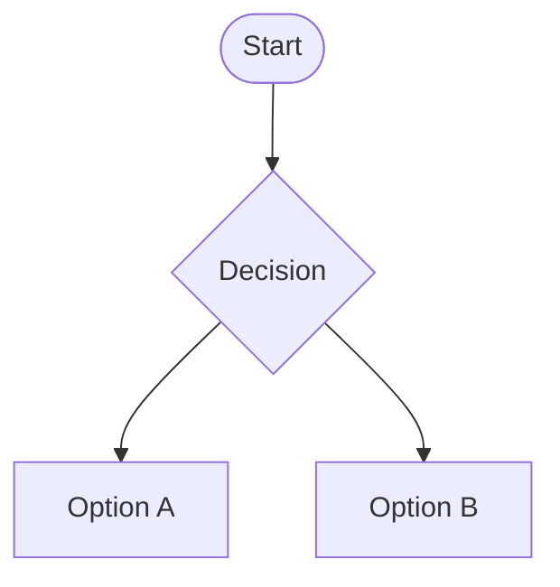
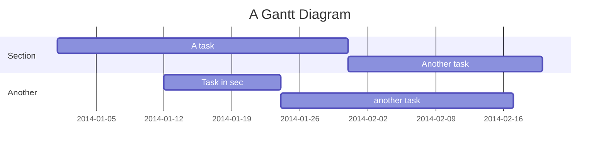
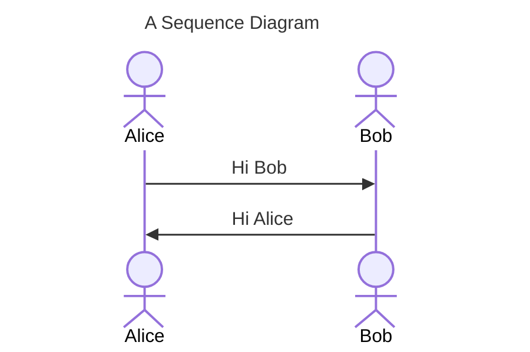

# SAP CRM Solution Rollout - Gantt Chart

For more samples see https://www.mermaidchart.com/play?new=true

```mermaid
flowchart
        A(["Start"])
        A --> B{"Decision"}
        B --> C["Option A"]
        B --> D["Option B"]
```

```mermaid
gantt
    title A Gantt Diagram
    dateFormat  YYYY-MM-DD
    section Section
    A task           :a1, 2014-01-01, 30d
    Another task     :after a1  , 20d
    section Another
    Task in sec      :2014-01-12  , 12d
    another task      : 24d
```

```mermaid
sequenceDiagram
        title A Sequence Diagram
        actor Alice
        actor Bob
        Alice->>Bob: Hi Bob
        Bob->>Alice: Hi Alice
```

